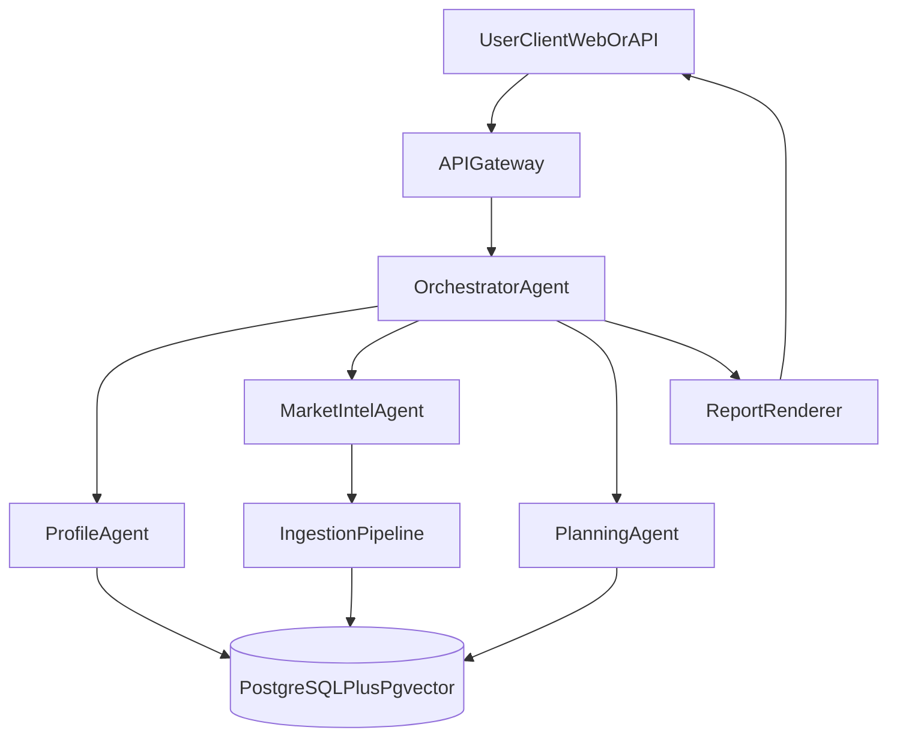
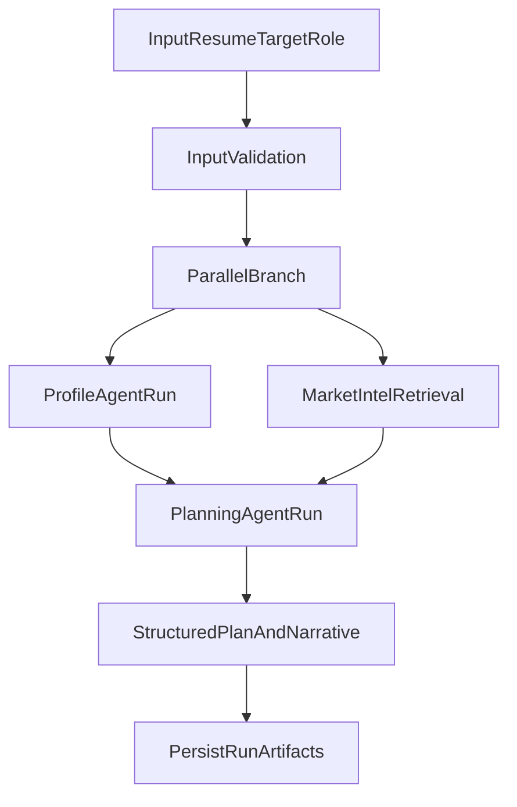

# GapSolver AI Full Agent System Design

This document defines a **complete AI Agent project architecture** for GapSolver AI, including optional **multi-agent orchestration**, production data pipelines, evaluation loops, and operational readiness.

## 1) System Goal

GapSolver AI is a market-aware career copilot that:

1. Understands a user's current skills from resume and artifacts.
2. Continuously tracks near-term hiring demand for target roles.
3. Computes explainable skill and experience gaps.
4. Generates phased, dependency-aware learning and project plans.
5. Re-plans over time based on user progress and market drift.

## 2) High-Level Architecture (Multi-Agent)

## 3) Agent Responsibilities

### OrchestratorAgent

- Owns request lifecycle and state machine.
- Delegates subtasks to specialized agents.
- Handles retries, fallback strategy, and response aggregation.
- Enforces SLOs (latency/timeouts) and policy guardrails.

### ProfileAgent

- Parses resume, project descriptions, and optional Git links.
- Extracts normalized skill graph: skills, level hints, experience evidence.
- Produces `user_skill_profile` with confidence and evidence spans.

### MarketIntelAgent

- Collects job postings from configured providers.
- Deduplicates and normalizes fields.
- Extracts atomic requirements and stores structured + vectorized entries.
- Maintains rolling demand windows (e.g. 30/60/90 days).

### PlanningAgent

- Converts prioritized gaps into staged plan:
  - Foundation
  - Core
  - Project
  - Interview-readiness
- Maps dependencies and prerequisites.
- Emits measurable outcomes and deliverables per stage.
- Internally runs three substeps:
  - gap scoring
  - plan generation
  - plan self-review and consistency checks

## 4) Orchestration Pattern

Primary execution model:

- **Planner-Orchestrator + Specialist Agents**
- Orchestrator calls specialist agents in DAG steps.
- Parallelizable steps:
  - Profile extraction and market retrieval can run concurrently after input validation.
- Synchronization steps:
  - Planning waits for profile + market outputs.
  - Planning internally executes `gap -> plan -> review` before final output.

Fallback behavior:

- If any specialist returns low confidence, orchestrator requests one targeted retry.
- If still low confidence, system returns partial results with explicit confidence notes.

## 5) Data Architecture

Core storage: PostgreSQL + pgvector.

Primary tables:

- `job_postings`
  - source metadata, role taxonomy, posted date, extracted skill atoms, embeddings
- `user_profiles`
  - normalized skills, evidence spans, historical snapshots
- `skill_taxonomy`
  - aliases, categories, prerequisites
- `gap_analyses`
  - scoring breakdowns per run
- `learning_plans`
  - staged tasks, dependencies, deliverables, plan versions
- `plan_feedback_events`
  - completion status, user feedback, follow-up outcomes

Indexes:

- btree: `role_family`, `posted_at`, `region`, `seniority`
- ivfflat/hnsw: embedding columns (role-query and JD vectors)

## 6) End-to-End Runtime Flow

## 7) Scoring Model (Explainable)

Example baseline:

`GapScore = DemandWeight * MissingConfidence * DependencyCriticality * RecencyWeight`

Where:

- `DemandWeight`: frequency in role-filtered recent postings
- `MissingConfidence`: confidence the user truly lacks the skill
- `DependencyCriticality`: impact on downstream skills
- `RecencyWeight`: stronger weight for recent demand

Each recommended item must include:

- score
- score components
- human-readable reason

## 8) Evaluation Framework

### Offline

- Skill extraction precision/recall on labeled resume/JD set.
- Retrieval quality (nDCG/Recall@k) for target-role relevance.
- Gap ranking quality against expert-labeled priorities.
- Plan validity checks (dependency consistency, completeness).

### Online

- Plan acceptance rate.
- Stage completion rate.
- Time-to-first-project-deliverable.
- Re-plan effectiveness after progress updates.

### Agent QA

- Structured output conformance rate.
- Retry rate and fallback rate per agent.
- Hallucination/error incident rate.

## 9) Service Boundaries

- `ingestion-service`: connectors + extraction + embedding + write path
- `agent-orchestrator-service`: multi-agent execution APIs
- `retrieval-service`: hybrid search endpoints
- `plan-service`: gap scoring + plan generation
- `report-service`: markdown/json/pdf rendering
- `monitoring-service`: metrics and traces

## 10) Ops, Security, and Compliance

- PII-aware logging and redaction for resumes.
- Secrets in key vault; no keys in repository.
- Row-level controls for multi-tenant mode.
- Audit trails for profile updates and plan decisions.
- Data retention + deletion workflows.
- SLOs:
  - p95 analysis latency target
  - ingestion freshness target
  - failed-run alerting

## 11) Deployment Strategy

Environment tiers:

- local dev
- staging
- production

Core runtime:

- containerized services
- managed PostgreSQL + pgvector extension
- queue/worker for asynchronous ingestion and heavy analysis runs

## 12) Current Code Mapping

Current repository implements a single-agent linear subset equivalent to:

- Orchestrator + Parser + Search + Rank + Planner in one LangGraph flow.

Mapped files:

- `src/graph/workflow.py`
- `src/nodes/parser_node.py`
- `src/nodes/search_node.py`
- `src/nodes/rank_node.py`
- `src/nodes/planner_node.py`
- `scripts/ingest_jobs.py`

This is the initial execution slice of the 4-agent architecture above.

## 13) Suggested Roadmap to Full System

Phase 1:

- stabilize single-agent path, add schema validation and eval harness.

Phase 2:

- split into 4 agents: Orchestrator + Profile + MarketIntel + Planning.

Phase 3:

- production ingestion connectors, feedback loop, online metrics dashboard.

Phase 4:

- multi-tenant hardening, governance controls, and cost optimization.

