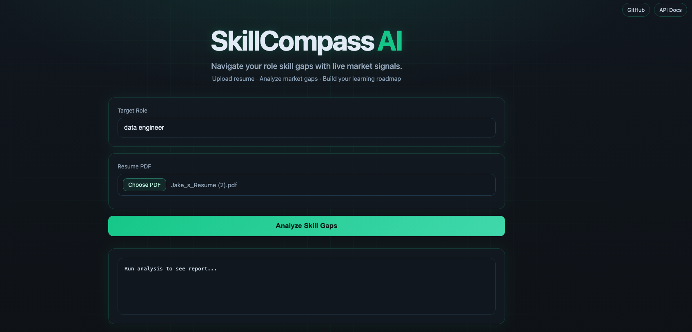
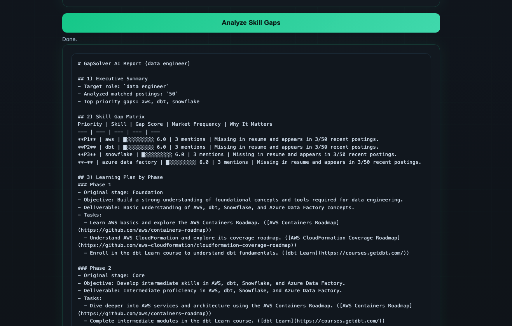
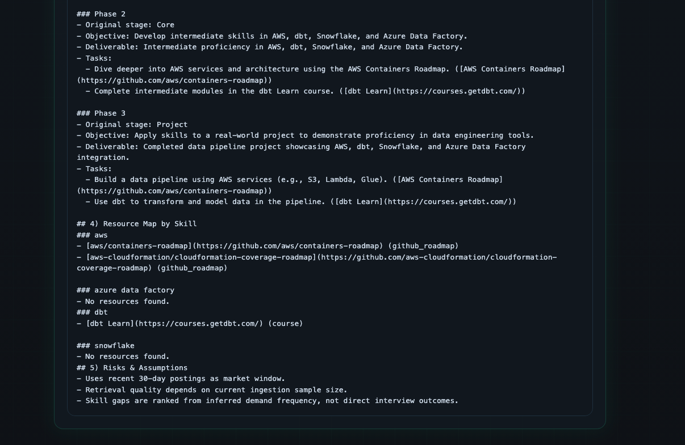

# SkillCompass AI

SkillCompass AI analyzes a resume against live job market postings, identifies technical skill gaps, and generates a practical learning roadmap.







## Features

- Resume skill extraction with Affinda + normalization pipeline.
- Job description (JD) skill extraction with Azure OpenAI + fallback parser.
- Gap ranking based on recent market frequency.
- 3-phase learning plan generation (Foundation / Core / Project).
- FastAPI web UI and JSON API.

## Tech Stack

- Python 3.10+
- FastAPI + Uvicorn
- LangGraph
- Azure OpenAI (chat + embeddings)
- PostgreSQL + pgvector
- Affinda Resume Parser
- Adzuna Jobs API

## Quick Start

1. Install dependencies:

```bash
python -m venv .venv
source .venv/bin/activate
pip install -e .
```

1. Configure environment:

```bash
cp .env.example .env
```

Fill in required keys in `.env`.

1. Start PostgreSQL/pgvector (example):

```bash
docker compose up -d
```

1. Run API server:

```bash
uvicorn src.api.app:app --reload --host 0.0.0.0 --port 8000
```

1. Open:

- UI: `http://localhost:8000`
- Docs: `http://localhost:8000/docs`

## API

- `GET /health`
- `POST /analyze`
- `POST /analyze-ui`

## Vercel Deployment

This repo includes Vercel-ready files:

- `api/index.py` (entrypoint)
- `vercel.json` (routing + runtime)
- `requirements.txt` (runtime install)

Deploy commands:

```bash
npm i -g vercel
vercel login
vercel --prod
```

Set the same environment variables from `.env` in Vercel Project Settings.
