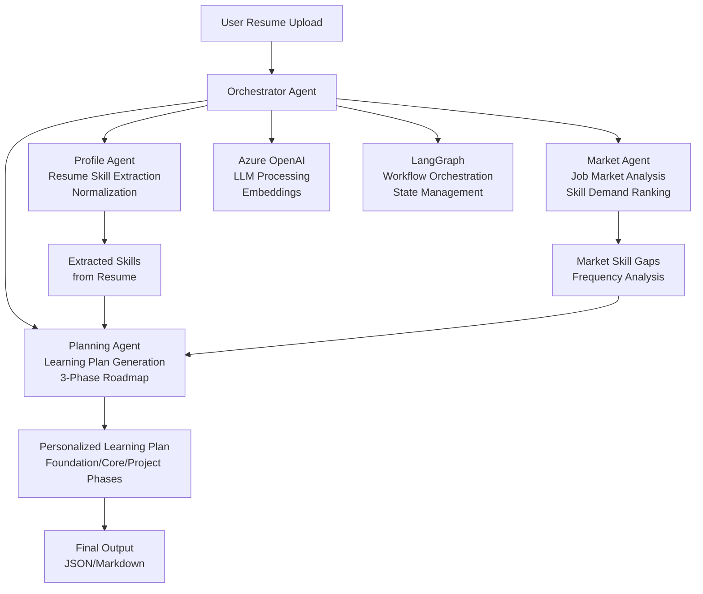

# SkillCompass AI

SkillCompass AI analyzes a resume against live job market postings, identifies technical skill gaps, and generates a practical learning roadmap.

## Features

- Resume skill extraction with Azure AI Document Intelligence (`prebuilt-layout` OCR + normalization heuristics).
- Job description (JD) skill extraction with Azure OpenAI + fallback parser.
- Gap ranking based on recent market frequency.
- 3-phase learning plan generation (Foundation / Core / Project).
- FastAPI web UI and JSON API.

## Tech Stack

- Python 3.10+
- FastAPI
- LangGraph
- Azure OpenAI (chat + embeddings)
- PostgreSQL + pgvector
- Azure AI Document Intelligence (resume parsing)
- Adzuna Jobs API
- Docker
- Vercel

## Architecture

SkillCompass AI's architecture centers around a multi-agent system powered by LangGraph and Azure OpenAI. The agents work collaboratively to analyze resumes, identify skill gaps, and generate personalized learning roadmaps.



### Agent Details

- **Orchestrator Agent**: Coordinates the entire analysis workflow, managing data flow between agents and ensuring seamless integration.
- **Profile Agent**: Extracts and normalizes skills from user resumes using Azure Document Intelligence (default `prebuilt-layout`) and custom normalization pipelines.
- **Market Agent**: Analyzes live job postings via Adzuna API, ranks skill gaps based on market frequency and demand.
- **Planning Agent**: Generates structured 3-phase learning plans (Foundation, Core, Project) tailored to identified skill gaps.

The agents leverage LangGraph for stateful workflow management and Azure OpenAI for intelligent text processing and embeddings, with PostgreSQL + pgvector handling vectorized data storage and retrieval.

## Quick Start

1. Install dependencies:

```bash
python -m venv .venv
source .venv/bin/activate
pip install -e .
```

Use the same interpreter for `uvicorn` (Document Intelligence needs `azure-ai-documentintelligence` from this install). If you see `No module named 'azure'`, you are not using the venv or need `pip install -e .` again.

1. Configure environment:

```bash
cp .env.example .env
```

Fill in required keys in `.env` (including `AZURE_DOCUMENT_INTELLIGENCE_ENDPOINT` and `AZURE_DOCUMENT_INTELLIGENCE_KEY` for resume parsing).

1. Start PostgreSQL/pgvector (example):

```bash
docker compose up -d
```

1. Create tables (first run only, or after a fresh DB):

```bash
python scripts/init_db.py
```

1. Run API server:

```bash
uvicorn src.api.app:app --reload --host 0.0.0.0 --port 8000
```

1. Open:

- UI: `http://localhost:8000`
- Docs: `http://localhost:8000/docs`

## API

- `GET /health`
- `POST /analyze`
- `POST /analyze-ui`

## Vercel Deployment

This repo includes Vercel-ready files:

- `api/index.py` (entrypoint)
- `vercel.json` (routing + runtime)
- `requirements.txt` (runtime install)

Deploy commands:

```bash
npm i -g vercel
vercel login
vercel --prod
```

Set the same environment variables from `.env` in Vercel Project Settings.


- Will work on improving the tech keywords extraction & Learning resources/roadmaps RAG
